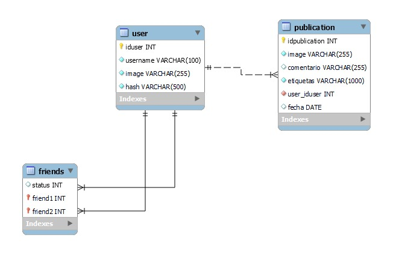

# SEMI1-13-PROYECTO2

## Arquitectura Implementada

## Base de Datos

## Servicios Implementados

Los siguientes servicios que nos ofrece AWS fueron implementados en el proyecto.
<ul>
    <li>Cognito</li>
    <li>EC2</li>
    <li>Lambda Funtions</li>
    <li>Lex</li>
    <li>Rekognition</li>
    <li>RDS</li>
    <li>S3</li>
    <li>Translate</li>
    <li>VPC</li>
</ul>

## Usuarios IAM

Se crearon usuarios especiales para cada uno de los siguientes servicios.
<ul>
    <li>Cognito</li>
    <li>Rekognition</li>
    <li>Translate</li>
    <li>S3</li>
    <li>Lex</li>
</ul>

## Permisos

A los usuarios se les concedió permiso FullAccess en cada uno de los servicios para el que fue creado.

## Roles

Para el único servicio que se tuvieron que crear roles espacies fue para la utilización del bot desde el backend, estos roles se creaban mientras se configuraba cognito y estos debían de tener agregara la política de AmazonLexRunBotsOnly.